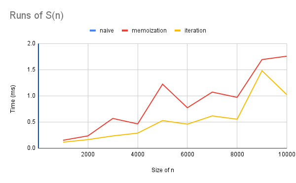

# How to run
This was made using deno and no external libraries.
To run the command `deno --v8-flags=--stack-size=8192 main.ts` was used inside `/layup/Layup Sequence`

# Explanation

I tried three different approaches with varying time and space complexities. The first approach was simply a copy and paste of the document, converted to code. The second approach came after I realized that this problem is a variation of the Fibonacci sequence, so I tried dynamic programming with memoization. After staring at the problem a bit longer, I realized that we only need the last two values, so we don't need to keep all previous values in memory, which led me to the third (iterative) approach. I left all attempts in the code because I thought plotting the graph would be interesting.

## Naive Approach

**time complexity: O($2^n$)** Each call generates 2 more calls

**space complexity: O(n)** Call stack grows linearly with input

```typescript
function S(n: number): bigint {
    if (n === 1) return BigInt(n);
    if (n === 2) return BigInt(n);
    if (n % 2 === 0) return S(n - 1) + S(n - 2);
    else return 2n * S(n - 1) - S(n - 2);
};
```

## With Memoization

**time complexity O(n)** need to go trough all the values once, calls are not recalculated because of the cache

**space complexity O(n)** need to store all values in a cache

```typescript
function S(n: number): bigint {
    if (cache[n]) return cache[n];
    return cache[n] = n % 2 === 0 ? S(n - 1) + S(n - 2) : 2n * S(n - 1) - S(n - 2);
};
```

## Iterative

**time complexity O(n)** need to go trough all the values once, use the last 2 values to calcualte current value

**space complexity O(1)** only needs a constant amount of memory

```typescript
function S(n: number): bigint {
    if (n < 3) return BigInt(n);

    let antepenultimate = 1n;
    let penultimate = 2n;
    let ultimate = 0n;

    for (let i = 3; i <= n; i++) {
        ultimate = i % 2 === 0
            ? penultimate + antepenultimate
            : 2n * penultimate - antepenultimate;
        antepenultimate = penultimate;
        penultimate = ultimate;
    }
    return ultimate;
};
```
## Run data
Note I did not run the naive version for n > 50 because it was too slow
| Input Size | Naive       | Memoization | Iteration  |
|------------|-------------|-------------|------------|
| 1          | 0.0198      |             |            |
| 5          | 0.003       |             |            |
| 10         | 0.0022      |             |            |
| 50         | 247223.5893 |             |            |
| 1000       |             | 0.1521      | 0.1157     |
| 2000       |             | 0.2359      | 0.1647     |
| 3000       |             | 0.5688      | 0.2349     |
| 4000       |             | 0.464       | 0.2884     |
| 5000       |             | 1.2236      | 0.5278     |
| 6000       |             | 0.7731      | 0.4594     |
| 7000       |             | 1.0722      | 0.6167     |
| 8000       |             | 0.9716      | 0.5534     |
| 9000       |             | 1.6937      | 1.4813     |
| 10000      |             | 1.7586      | 1.0222     |

Need to squint to see the blue line for the naive aproach

